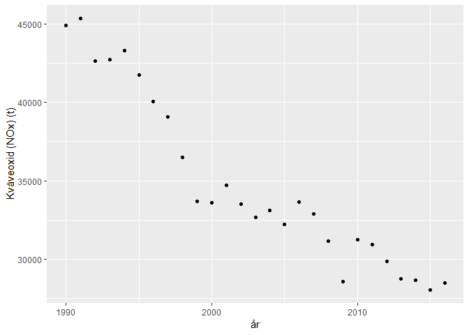

HW1
================

Past Experiences with R
=======================

My previous experiences with R all come from courses in mathematical statistics. I have not used Git and/or Github before, so this is a new chapter for me. I have also not used the packages ggplot2 and/or dplyr before.



Retrieving the data
===================

I have retrieved the data from SCB's page, copied the data and created a dataframe containing said data.

``` r
sessionInfo()
```

    ## R version 3.5.1 (2018-07-02)
    ## Platform: x86_64-w64-mingw32/x64 (64-bit)
    ## Running under: Windows 10 x64 (build 17134)
    ## 
    ## Matrix products: default
    ## 
    ## locale:
    ## [1] LC_COLLATE=Swedish_Sweden.1252  LC_CTYPE=Swedish_Sweden.1252   
    ## [3] LC_MONETARY=Swedish_Sweden.1252 LC_NUMERIC=C                   
    ## [5] LC_TIME=Swedish_Sweden.1252    
    ## 
    ## attached base packages:
    ## [1] stats     graphics  grDevices utils     datasets  methods   base     
    ## 
    ## other attached packages:
    ## [1] forcats_0.3.0   stringr_1.3.1   dplyr_0.7.6     purrr_0.2.5    
    ## [5] readr_1.1.1     tidyr_0.8.1     tibble_1.4.2    ggplot2_3.0.0  
    ## [9] tidyverse_1.2.1
    ## 
    ## loaded via a namespace (and not attached):
    ##  [1] Rcpp_0.12.18     cellranger_1.1.0 pillar_1.3.0     compiler_3.5.1  
    ##  [5] plyr_1.8.4       bindr_0.1.1      tools_3.5.1      digest_0.6.17   
    ##  [9] lubridate_1.7.4  jsonlite_1.5     evaluate_0.11    nlme_3.1-137    
    ## [13] gtable_0.2.0     lattice_0.20-35  pkgconfig_2.0.2  rlang_0.2.2     
    ## [17] cli_1.0.0        rstudioapi_0.8   yaml_2.2.0       haven_1.1.2     
    ## [21] bindrcpp_0.2.2   withr_2.1.2      xml2_1.2.0       httr_1.3.1      
    ## [25] knitr_1.20       hms_0.4.2        rprojroot_1.3-2  grid_3.5.1      
    ## [29] tidyselect_0.2.4 glue_1.3.0       R6_2.2.2         readxl_1.1.0    
    ## [33] rmarkdown_1.10   modelr_0.1.2     magrittr_1.5     backports_1.1.2 
    ## [37] scales_1.0.0     htmltools_0.3.6  rvest_0.3.2      assertthat_0.2.0
    ## [41] colorspace_1.3-2 labeling_0.3     stringi_1.1.7    lazyeval_0.2.1  
    ## [45] munsell_0.5.0    broom_0.5.0      crayon_1.3.4
