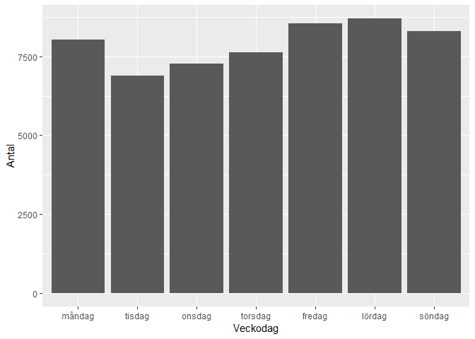
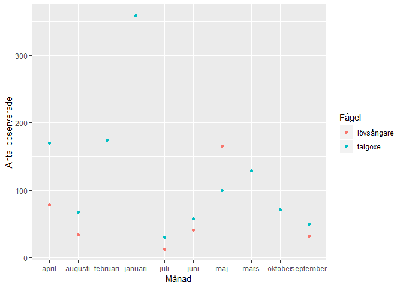
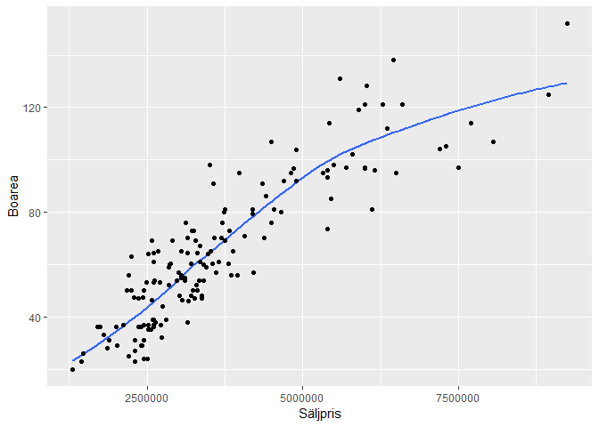
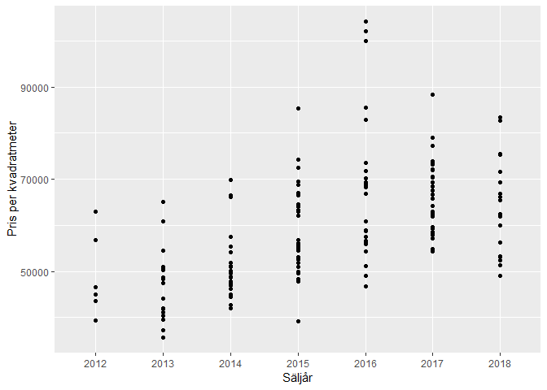
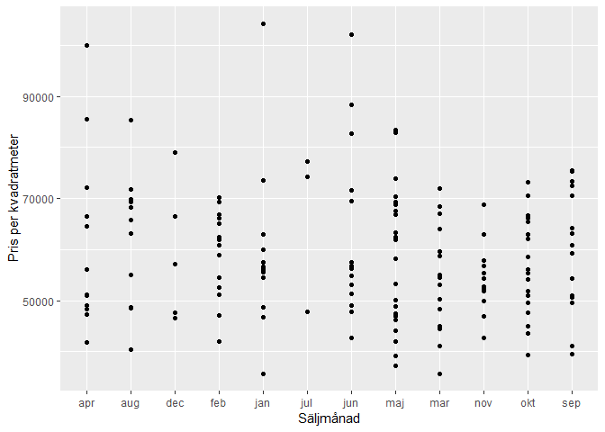
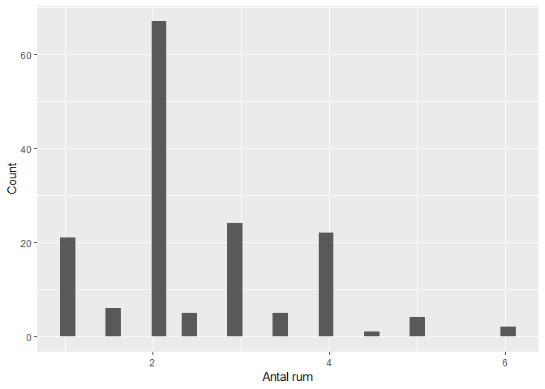
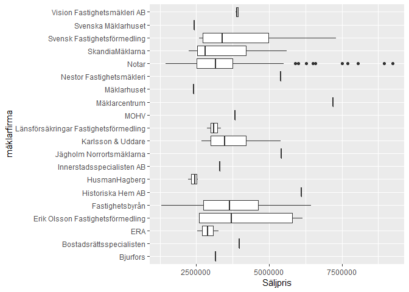

HW2
================

Antalet av varje fågelart som skådades under Januari och Juli.

| Common name                    |  Observed (In January)|
|:-------------------------------|----------------------:|
| koltrast                       |                    443|
| talgoxe                        |                    358|
| blåmes                         |                    356|
| björktrast                     |                    297|
| skata                          |                    297|
| gråsparv                       |                    248|
| gräsand                        |                    238|
| mindre korsnäbb                |                    234|
| gråtrut                        |                    221|
| nötskrika                      |                    220|
| storskrake                     |                    218|
| kråka                          |                    217|
| bändelkorsnäbb                 |                    214|
| knölsvan                       |                    207|
| grönfink                       |                    200|
| vigg                           |                    200|
| nötväcka                       |                    198|
| sothöna                        |                    183|
| gråsiska                       |                    177|
| tamduva                        |                    175|
| pilfink                        |                    174|
| större hackspett               |                    170|
| knipa                          |                    165|
| kanadagås                      |                    137|
| skrattmås                      |                    136|
| storskarv                      |                    135|
| kaja                           |                    133|
| gärdsmyg                       |                    129|
| sångsvan                       |                    123|
| steglits                       |                    118|
| bofink                         |                    114|
| domherre                       |                    114|
| fiskmås                        |                    108|
| duvhök                         |                    107|
| brunand                        |                     90|
| stenknäck                      |                     84|
| rödhake                        |                     79|
| berguv                         |                     68|
| trädkrypare                    |                     63|
| gråhäger                       |                     60|
| grönsiska                      |                     60|
| bergfink                       |                     59|
| sparvhök                       |                     58|
| korp                           |                     53|
| sidensvans                     |                     50|
| entita                         |                     49|
| tofsmes                        |                     47|
| vitkindad gås                  |                     47|
| gråkråka                       |                     42|
| gröngöling                     |                     42|
| svartmes                       |                     42|
| kattuggla                      |                     38|
| kungsfågel                     |                     38|
| stjärtmes                      |                     37|
| gulsparv                       |                     36|
| ringduva                       |                     33|
| havsörn                        |                     28|
| rörhöna                        |                     28|
| ormvråk                        |                     26|
| havstrut                       |                     17|
| strömstare                     |                     12|
| dubbeltrast                    |                     10|
| skäggmes                       |                     10|
| spillkråka                     |                      8|
| sävsparv                       |                      8|
| smådopping                     |                      7|
| alfågel                        |                      6|
| fasan                          |                      6|
| tornfalk                       |                      5|
| varfågel                       |                      5|
| skogsduva                      |                      4|
| snatterand                     |                      4|
| rödvingetrast                  |                      3|
| svarthakedopping               |                      3|
| grågås                         |                      2|
| mindre hackspett               |                      2|
| morkulla                       |                      2|
| snösiska                       |                      2|
| stjärtand                      |                      2|
| storskarv, underarten sinensis |                      2|
| brunsiska                      |                      1|
| enkelbeckasin                  |                      1|
| havsörnar                      |                      1|
| hämpling                       |                      1|
| kricka                         |                      1|
| nötväcka, underarten europaea  |                      1|
| nötväckor                      |                      1|
| skata, underarten pica         |                      1|
| stare                          |                      1|
| större korsnäbb                |                      1|
| svarthätta                     |                      1|
| trana                          |                      1|

| Common name                      |  Observed (In July)|
|:---------------------------------|-------------------:|
| koltrast                         |                  76|
| silltrut                         |                  73|
| ringduva                         |                  67|
| tornseglare                      |                  66|
| steglits                         |                  56|
| sothöna                          |                  49|
| fiskmås                          |                  46|
| stare                            |                  45|
| grönfink                         |                  42|
| rödhake                          |                  42|
| gräsand                          |                  36|
| sädesärla                        |                  34|
| rörhöna                          |                  33|
| fisktärna                        |                  31|
| knölsvan                         |                  31|
| björktrast                       |                  30|
| talgoxe                          |                  30|
| gråsparv                         |                  29|
| skogsduva                        |                  28|
| bofink                           |                  27|
| gråhäger                         |                  27|
| svarthätta                       |                  27|
| blåmes                           |                  26|
| gärdsmyg                         |                  25|
| skata                            |                  25|
| skäggdopping                     |                  24|
| skrattmås                        |                  23|
| vitkindad gås                    |                  23|
| gråtrut                          |                  22|
| kråka                            |                  22|
| nötväcka                         |                  21|
| större hackspett                 |                  21|
| mindre korsnäbb                  |                  20|
| tamduva                          |                  20|
| taltrast                         |                  18|
| grå flugsnappare                 |                  16|
| korp                             |                  16|
| ladusvala                        |                  16|
| nötskrika                        |                  16|
| stenknäck                        |                  15|
| grönbena                         |                  14|
| gröngöling                       |                  14|
| kaja                             |                  14|
| lövsångare                       |                  13|
| tofsvipa                         |                  13|
| trädgårdssångare                 |                  13|
| skogssnäppa                      |                  12|
| smådopping                       |                  12|
| snatterand                       |                  12|
| sparvhök                         |                  12|
| strandskata                      |                  12|
| silltrut, underarten fuscus      |                  11|
| storskarv                        |                  11|
| tofsmes                          |                  10|
| törnskata                        |                  10|
| vigg                             |                  10|
| duvhök                           |                   9|
| grönsiska                        |                   9|
| mindre strandpipare              |                   9|
| pilfink                          |                   9|
| grönsångare                      |                   8|
| rödstjärt                        |                   8|
| hussvala                         |                   7|
| svartvit flugsnappare            |                   7|
| drillsnäppa                      |                   6|
| enkelbeckasin                    |                   6|
| kanadagås                        |                   6|
| kattuggla                        |                   6|
| kricka                           |                   6|
| ormvråk                          |                   6|
| stenskvätta                      |                   6|
| sånglärka                        |                   6|
| trädkrypare                      |                   6|
| gluttsnäppa                      |                   5|
| grågås                           |                   5|
| lärkfalk                         |                   5|
| större korsnäbb                  |                   5|
| svarthakedopping                 |                   5|
| havsörn                          |                   4|
| ärtsångare                       |                   4|
| brunand                          |                   3|
| dubbeltrast                      |                   3|
| grågås x kanadagås               |                   3|
| havstrut                         |                   3|
| kungsfågel                       |                   3|
| rödvingetrast                    |                   3|
| rörsångare                       |                   3|
| spillkråka                       |                   3|
| svart rödstjärt                  |                   3|
| sångsvan                         |                   3|
| törnsångare                      |                   3|
| bivråk                           |                   2|
| fiskgjuse                        |                   2|
| gulsparv                         |                   2|
| gök                              |                   2|
| mindre hackspett                 |                   2|
| måsfåglar                        |                   2|
| nötkråka/nötskrika               |                   2|
| silvertärna                      |                   2|
| stjärtmes                        |                   2|
| svartmes                         |                   2|
| sävsångare                       |                   2|
| brun kärrhök                     |                   1|
| buskskvätta                      |                   1|
| bändelkorsnäbb                   |                   1|
| entita                           |                   1|
| fisk-/silvertärna                |                   1|
| fiskmås, underarten canus        |                   1|
| fisktärna, underarten hirundo    |                   1|
| gransångare                      |                   1|
| gråkråka                         |                   1|
| gulärla                          |                   1|
| hämpling                         |                   1|
| härmsångare                      |                   1|
| knipa                            |                   1|
| korsnäbbar                       |                   1|
| kustpipare                       |                   1|
| kärrsångare                      |                   1|
| måsar och trutar                 |                   1|
| nötväcka, underarten europaea    |                   1|
| rosenfink                        |                   1|
| silltrut, underarten intermedius |                   1|
| småskrake                        |                   1|
| sommargylling                    |                   1|
| storlom                          |                   1|
| storskarv, underarten carbo      |                   1|
| storskarv, underarten sinensis   |                   1|
| storskrake                       |                   1|
| talltita                         |                   1|
| tornfalk                         |                   1|
| trädlärka                        |                   1|
| trädpiplärka                     |                   1|
| vitryggig hackspett              |                   1|

En barplot som visar veckodagar och hur många fåglar som skådades under respektive veckodag.

En simpel tabell som visar de första fem unika åskådarna av lövsångare

| Recorded\_by              | Date      |
|:--------------------------|:----------|
| Leif Godin                | 20 maj 01 |
| Vincent Claesson          | 20 maj 01 |
| Måns Söderberg            | 20 maj 01 |
| Gunnar Dolk               | 20 maj 01 |
| Kjell Kroon, Carina Häger | 20 maj 01 |

Nedan illustreras antalet observerade lövsångare och talgoxar, sorterade enligt den månad de blev observerade.

Denna plot visar samband mellan Boarea och säljpris.

Graferna under syftar på att se om det finns någon månads- och årstrend när det gäller kvadratmeterpriset.

I denna tabell så har jag valt att visa medelvärdet på kvadratmeterpriset, sorterat efter månad.

| Säljmånad |  Medelpris av Kvm|
|:----------|-----------------:|
| apr       |          61096.31|
| aug       |          62350.86|
| dec       |          59383.46|
| feb       |          59221.85|
| jan       |          58914.72|
| jul       |          66438.44|
| jun       |          63103.15|
| maj       |          57906.64|
| mar       |          54499.72|
| nov       |          54394.85|
| okt       |          56315.60|
| sep       |          60035.75|

Histogrammet visar hur många lägenheter som hade x antal rum.

    ## `stat_bin()` using `bins = 30`. Pick better value with `binwidth`.

I boxplotten nedan illustreras mäklarfirma mot Säljpris.

