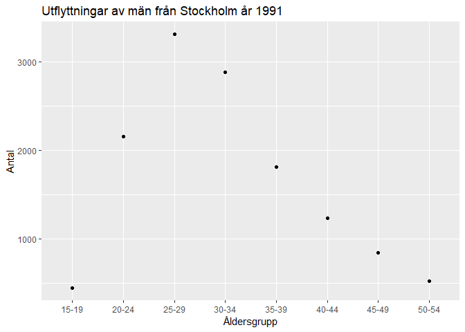
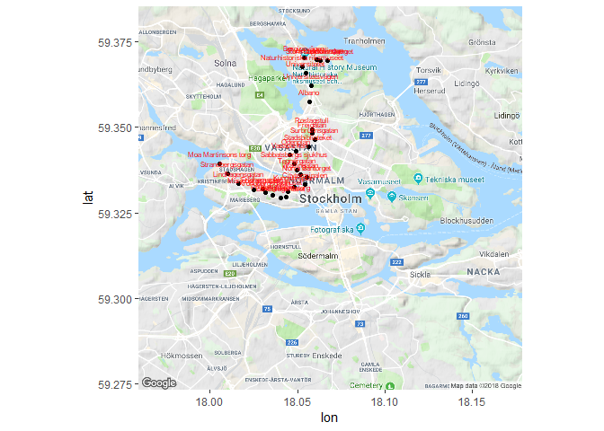

Homework 3
================
Philip Sierpinski
24 november 2018

Uppgift 1
---------

My "wide table" shows the amount of savings (in Mkr) of a certain sector in the swedish economy per year and quartile.

My tide in the "wide" format.

``` r
library(tidyverse)
data_points<-data.frame(-5079, 2335, 2114, -4108, 11138, 887, 833, -1129, 3410, 13102, -3483, -10901, 1170, 1727, 4126, -3421, 2780, 165, 6370, 10111, 24977, 5617, 19493, 8380, 4795, -4366, 6116, 3394, 4467, 2881)
names(data_points) <- c("2009K2","2009K3","2009K4","2010K1","2010K2","2010K3","2010K4","2011K1","2011K2","2011K3","2011K4","2012K1","2012K2","2012K3","2012K4","2013K1","2013K2","2013K3","2013K4","2014K1","2014K2","2014K3","2014K4","2015K1","2015K2","2015K3","2015K4","2016K1","2016K2","2016K3")

knitr::kable(data_points)
```

|  2009K2|  2009K3|  2009K4|  2010K1|  2010K2|  2010K3|  2010K4|  2011K1|  2011K2|  2011K3|  2011K4|  2012K1|  2012K2|  2012K3|  2012K4|  2013K1|  2013K2|  2013K3|  2013K4|  2014K1|  2014K2|  2014K3|  2014K4|  2015K1|  2015K2|  2015K3|  2015K4|  2016K1|  2016K2|  2016K3|
|-------:|-------:|-------:|-------:|-------:|-------:|-------:|-------:|-------:|-------:|-------:|-------:|-------:|-------:|-------:|-------:|-------:|-------:|-------:|-------:|-------:|-------:|-------:|-------:|-------:|-------:|-------:|-------:|-------:|-------:|
|   -5079|    2335|    2114|   -4108|   11138|     887|     833|   -1129|    3410|   13102|   -3483|  -10901|    1170|    1727|    4126|   -3421|    2780|     165|    6370|   10111|   24977|    5617|   19493|    8380|    4795|   -4366|    6116|    3394|    4467|    2881|

My converted long table

``` r
data_points%>% 
  gather(names(data_points),key="year", value="data_points") %>%
  separate(year, into = c("year", "Kvartal"), sep = "K", convert=TRUE)%>%
  knitr::kable()
```

|  year|  Kvartal|  data\_points|
|-----:|--------:|-------------:|
|  2009|        2|         -5079|
|  2009|        3|          2335|
|  2009|        4|          2114|
|  2010|        1|         -4108|
|  2010|        2|         11138|
|  2010|        3|           887|
|  2010|        4|           833|
|  2011|        1|         -1129|
|  2011|        2|          3410|
|  2011|        3|         13102|
|  2011|        4|         -3483|
|  2012|        1|        -10901|
|  2012|        2|          1170|
|  2012|        3|          1727|
|  2012|        4|          4126|
|  2013|        1|         -3421|
|  2013|        2|          2780|
|  2013|        3|           165|
|  2013|        4|          6370|
|  2014|        1|         10111|
|  2014|        2|         24977|
|  2014|        3|          5617|
|  2014|        4|         19493|
|  2015|        1|          8380|
|  2015|        2|          4795|
|  2015|        3|         -4366|
|  2015|        4|          6116|
|  2016|        1|          3394|
|  2016|        2|          4467|
|  2016|        3|          2881|

By converting to a long format i can now easier filter the variables.

``` r
data_points%>% 
  gather(names(data_points),key="year", value="data_points") %>%
  separate(year, into = c("year", "Kvartal"), sep = "K", convert=TRUE)%>%
  filter(year=="2009")%>%
  knitr::kable()
```

|  year|  Kvartal|  data\_points|
|-----:|--------:|-------------:|
|  2009|        2|         -5079|
|  2009|        3|          2335|
|  2009|        4|          2114|

My long table shows the age group along with the sex of people moving out of stockholm. By spreading the data I can easier illustrate how men in different age groups compare to eachother.

``` r
male_data <- read_csv("../HW3/HW3_files/datan.csv")
male_data<-male_data%>%
  select(age,sex,"1991")
knitr::kable(male_data)
```

| age   | sex   |  1991|
|:------|:------|-----:|
| 15-19 | men   |   445|
| 15-19 | women |   663|
| 20-24 | men   |  2156|
| 20-24 | women |  3094|
| 25-29 | men   |  3309|
| 25-29 | women |  3673|
| 30-34 | men   |  2882|
| 30-34 | women |  2444|
| 35-39 | men   |  1811|
| 35-39 | women |  1253|
| 40-44 | men   |  1235|
| 40-44 | women |   824|
| 45-49 | men   |   840|
| 45-49 | women |   673|
| 50-54 | men   |   517|
| 50-54 | women |   379|

``` r
male_data_use<-male_data%>%
  select(age,sex,"1991")%>%
  spread(key="sex", value="1991")

knitr::kable(male_data_use)
```

| age   |   men|  women|
|:------|-----:|------:|
| 15-19 |   445|    663|
| 20-24 |  2156|   3094|
| 25-29 |  3309|   3673|
| 30-34 |  2882|   2444|
| 35-39 |  1811|   1253|
| 40-44 |  1235|    824|
| 45-49 |   840|    673|
| 50-54 |   517|    379|

``` r
ggplot(male_data_use,aes(age,men)) + 
  geom_point() +
  ggtitle("Utflyttningar av män från Stockholm år 1991")+
  labs(y="Antal",x="Åldersgrupp")
```



UPPGIFT 2
---------

``` r
stop_area<-read_csv("../HW_data/StopArea.csv")
Line <-read_csv("../HW_data/Line.csv")
Journey_Pattern <- read_csv("../HW_data/JourneyPattern.csv")
Journey_Pattern <- Journey_Pattern %>%
  mutate(JourneyPatternPointNumber = as.integer(JourneyPatternPointNumber))
```

``` r
stop_area%>%
  count(StopPointNumber) #<--- primary
```

    ## # A tibble: 13,254 x 2
    ##    StopPointNumber     n
    ##              <int> <int>
    ##  1             306     1
    ##  2             308     1
    ##  3             309     1
    ##  4             310     1
    ##  5             312     1
    ##  6             313     1
    ##  7             314     1
    ##  8             315     1
    ##  9             316     1
    ## 10             318     1
    ## # ... with 13,244 more rows

``` r
Journey_Pattern%>%   #<---primary
  count(JourneyPatternPointNumber,LineNumber,DirectionCode)
```

    ## # A tibble: 26,869 x 4
    ##    JourneyPatternPointNumber LineNumber DirectionCode     n
    ##                        <int>      <int>         <int> <int>
    ##  1                       101         16             1     1
    ##  2                       101         16             2     1
    ##  3                       101         17             1     1
    ##  4                       101         17             2     1
    ##  5                       101         23             1     1
    ##  6                       101         23             2     1
    ##  7                       102         16             1     1
    ##  8                       102         16             2     1
    ##  9                       102         17             1     1
    ## 10                       102         17             2     1
    ## # ... with 26,859 more rows

``` r
matches<-stop_area %>% 
   semi_join(Journey_Pattern, c("StopPointNumber" = "JourneyPatternPointNumber"))
```

JourneyPatternPointNumber corresponds to StopPointNumber, where StopPointNumber corresponds to a StopPoint with a name. From there we can figure out a route and map the different stoppoint names.

StopArea contains information about the different stop points, JourneyPattern contains information about the different routes for all the public transportations, Lines contains all the information about the method of the transportation.

Each unique JourneyPatternPointNumber is *not* matched in StopPointNumber in the StopArea table. I have here filtered out all the unique JourneyPatternPointNumber that *cannot* be matched in StopPointNumber.

``` r
mismatch<-Journey_Pattern %>%
  anti_join(stop_area,c("JourneyPatternPointNumber" = "StopPointNumber"))%>%
  group_by(JourneyPatternPointNumber)%>%
  summarise(n = n()) %>%
  arrange(desc(n))%>%
  head(10)
mismatch
```

    ## # A tibble: 10 x 2
    ##    JourneyPatternPointNumber     n
    ##                        <int> <int>
    ##  1                       301    20
    ##  2                       401    17
    ##  3                       408    15
    ##  4                       955    15
    ##  5                       407    13
    ##  6                       902    13
    ##  7                       904    13
    ##  8                       402    11
    ##  9                       403    11
    ## 10                       409    11

As seen there are 281 unique JourneyPatternPointNumber's that are not matched by StopPointNumbers in StopArea. After a long time of pondering I still dont feel comfortable with my assessment, but my best guess is that the JourneyPatternPointNumbers that dont have a matching StopPointNumber in StopArea are inactive or out of service. Most of the JourneyPatternPointNumbers are also under 1000, which seem to be of the StopAreaTypeCode SHIPBER.

If these mismatched PatternNumbers are indeed inactive stations, I would mutate a new binary variable that states if a StopPointNumber is 1(active) or 0(inactive).

The number of active busstops in the different zones

``` r
#Join the tables together
#filter to busses only, remove "inactive"
#Group by Zone names and display only unique JourneyPatterns(which are matched to StopPoints) and summarise them
busstops<-Journey_Pattern%>%
  left_join(Line, by = "LineNumber")%>%
  left_join(stop_area, c("JourneyPatternPointNumber" = "StopPointNumber"))%>%
  filter(DefaultTransportModeCode=="BUS", !is.na(StopPointName))%>%
  group_by(ZoneShortName)%>%
  distinct(JourneyPatternPointNumber)%>%
  summarise(n = n())
busstops
```

    ## # A tibble: 4 x 2
    ##   ZoneShortName     n
    ##   <chr>         <int>
    ## 1 A              3112
    ## 2 B              3674
    ## 3 C              4107
    ## 4 <NA>              3

I have here chosen to plot the bus "50", a change in the filter option can generalise this to any LineNumber.

``` r
library(ggmap)
load("../HW_data/Stockholm_map.Rdata")
matches3<-stop_area%>%
  left_join(Journey_Pattern, c("StopPointNumber" = "JourneyPatternPointNumber"))
MyRoute<- matches3 %>%
  rename(lon = LocationEastingCoordinate, lat = LocationNorthingCoordinate, name = StopPointName)%>%
  group_by(name)%>%
  filter(LineNumber=="50", DirectionCode == "1")
  
ggmap(stockholm) + geom_point(data = MyRoute, aes(x = lon, y = lat)) +
    geom_text(data = MyRoute, aes(x = lon, y = lat, label = name), nudge_y = .003, color = "red", size=2)
```


