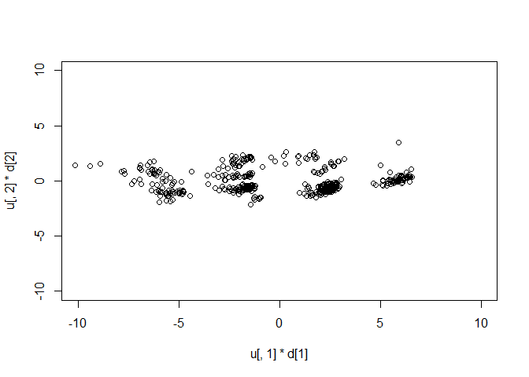
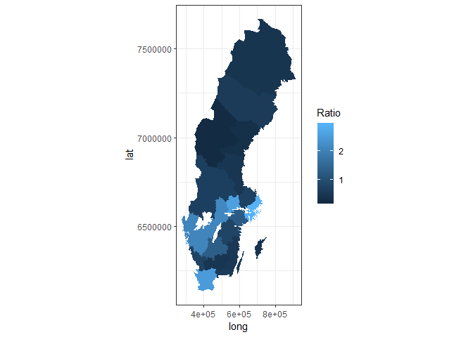
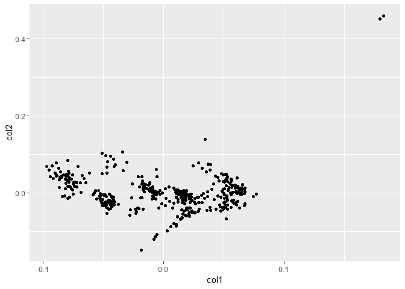
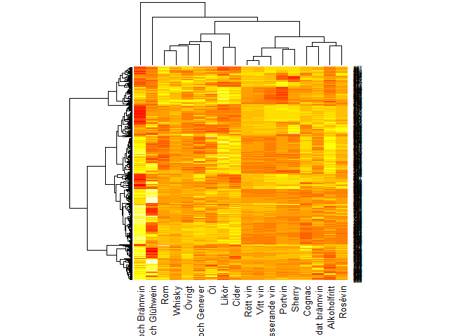
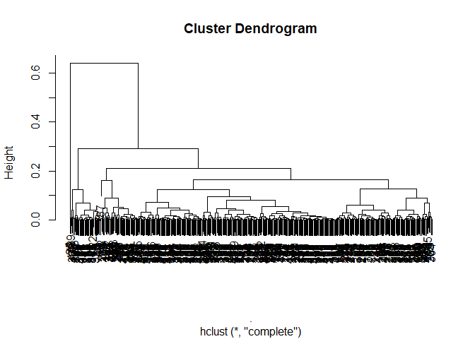

HW4
================
Philip Sierpinski
1 december 2018

R Markdown
----------

``` r
library(RSQLite)
library(DBI)
library(tidyverse)
library(dbplyr)
library(plyr)
```

``` r
#my query for the database.
my_db <- DBI::dbConnect(RSQLite::SQLite(), "../HW_data/system.sqlite")
dbListTables(my_db) #checking tables in my_db
```

    ## [1] "stock" "store"

``` r
stock <- dbGetQuery(my_db, "SELECT * FROM stock") #to view the data
store <- dbGetQuery(my_db, "SELECT * FROM store") #to view the data
```

``` r
#my query for butik_ombud in SQL
butik_ombud <- dbGetQuery(my_db, "SELECT Address5 AS county, COUNT(Address5) AS Number, Typ AS Type
                          FROM store
                          GROUP BY Address5,Typ"
                          )
glimpse(butik_ombud)
```

    ## Observations: 43
    ## Variables: 3
    ## $ county <chr> NA, "Blekinge län", "Blekinge län", "Dalarnas län", "Da...
    ## $ Number <int> 0, 6, 10, 18, 26, 3, 7, 12, 25, 10, 13, 11, 46, 16, 12,...
    ## $ Type   <chr> "Ombud", "Butik", "Ombud", "Butik", "Ombud", "Butik", "...

``` r
#my query for assortment in SQL
assortment <- dbGetQuery(my_db, "SELECT Nr AS Store, Address5 AS county, Address4 as City, stock.Varugrupp AS Product, stock.AntalProdukter
FROM store JOIN stock
ON store.Nr = stock.ButikNr")

assortment_wide <- assortment %>%
  group_by(Store)%>%
  mutate(AntalProdukter = AntalProdukter / sum(AntalProdukter)) %>%
  spread(key = Product,value = AntalProdukter)

x<-assortment_wide[,4:21]%>%
  mutate_all(scale)


u <- svd(na.omit(x))$u
d <- svd(na.omit(x))$d
v <- svd(na.omit(x))$v

plot(u[,1]*d[1], u[,2]*d[2], xlim = c(-10, 10), ylim = c(-10,10))
```



If there are more stores than agents we get a higher "ratio".

``` r
type_ombud<- butik_ombud%>%
  filter(Type=="Ombud")

type_butik<- butik_ombud%>%
  filter(Type=="Butik")%>%
  left_join(type_ombud, by="county")%>%
  mutate(Antal_Butiker = Number.x, Antal_Ombud = Number.y)%>%
  select(county,Antal_Butiker,Antal_Ombud)%>%
  mutate(county = as.factor(county))%>%
  mutate(Ratio = Antal_Butiker / Antal_Ombud)
levels(type_butik$county) <- c("Blekinge", "Dalarnas", "Gotlands", "Gävleborgs", "Hallands", "Jämtlands", "Jönköpings", "Kalmar", "Kronobergs", "Norrbottens", "Skåne", "Stockholms", "Södermanlands", "Uppsala", "Värmlands", "Västerbottens", "Västernorrlands", "Västmanlands","Västra Götalands", "Örebro", "Östergötlands")


counties <- read_csv("../HW_data/counties.csv")
```

    ## Parsed with column specification:
    ## cols(
    ##   .id = col_integer(),
    ##   long = col_double(),
    ##   lat = col_double(),
    ##   order = col_integer(),
    ##   hole = col_logical(),
    ##   piece = col_integer(),
    ##   id = col_integer(),
    ##   group = col_double(),
    ##   LnKod = col_integer(),
    ##   LnNamn = col_character()
    ## )

``` r
counties<-counties %>%
  mutate(county = as.factor(LnNamn))%>%
  select(-LnNamn)%>%
  left_join(type_butik, by="county")


  


ggplot(counties) + geom_polygon(aes(x = long, y = lat, group = group, fill = Ratio)) +
    coord_fixed() +
    theme_bw()
```



The visual cluster does show a few clusters present.

``` r
assortment_wide[,4:21]%>%
  dist()%>%
  hclust()%>%
    plot(hang = -1)
```



``` r
x<-assortment_wide[,4:21]%>%
  mutate_all(scale)
heatmap(as.matrix(x))
```



``` r
u1 <- svd(na.omit(t(x)))$u
d1 <- svd(na.omit(t(x)))$d
v1 <- svd(na.omit(t(x)))$v
plot(u1[,1]*d1[1], u1[,2]*d1[2], xlim = c(-30, 30), ylim = c(-30,30))
```


