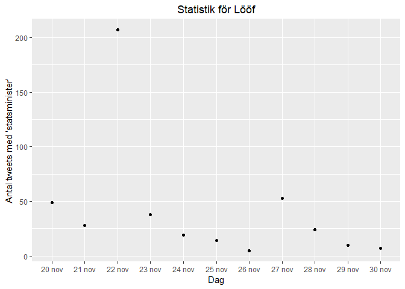
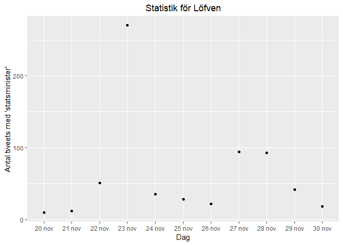
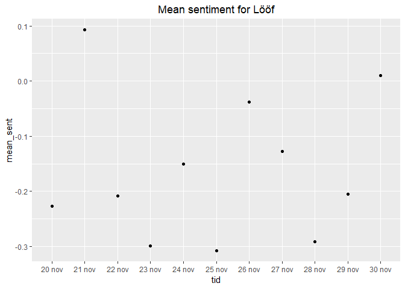
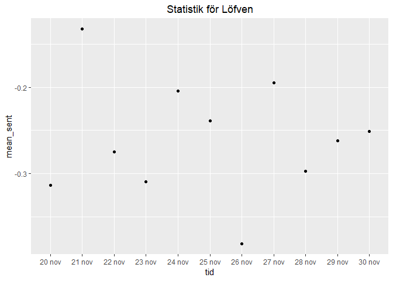
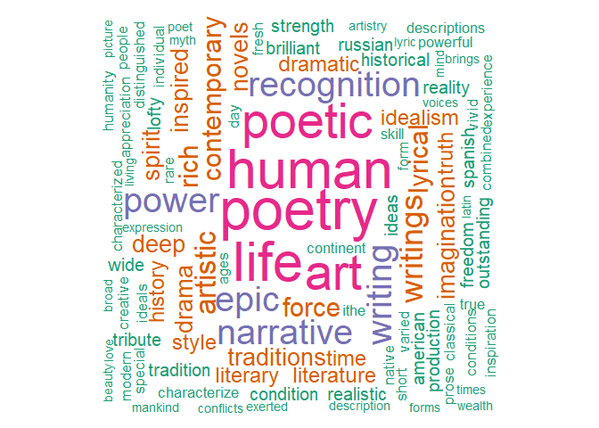

HW5
================
Philip Sierpinski
6 december 2018

``` r
load("../HW_data/LoofLofvenTweets.Rdata")
library(stringr)
library(tidyverse)
library(quanteda)
library(httr)
library(rlist)
library(tm)
library(wordcloud)
library(jsonlite)
```

``` r
tweets_full<- Lofven %>%
  full_join(Loof, by = "text")
tweets_inner <- Lofven %>%
  inner_join(Loof, by = "text")

#Remove the inner join from the full join, leaving only values that were unique in Loof or Lofven
tweets_full_var<-tweets_full %>% 
  anti_join(tweets_inner, by="text")

tweets<- tweets_full_var %>%
  select(text)%>%
  mutate(Person = str_extract(tweets_full_var$text, "Lööf|Löfven"))%>%
  group_by(Person)
```

``` r
tiden <- c(tweets_full_var$created_at.x,tweets_full_var$created_at.y)
tiden <- tiden[!is.na(tiden)]
# combine the times 
tweets_filter <- tweets_full_var %>%
  select(created_at.x,created_at.y,text)%>%
  mutate(Person = str_extract(tweets_full_var$text, "Lööf|Löfven"))%>%
  mutate(tid = tiden)%>%
  select(text,Person,tid)%>%
  mutate(tid = format(tid, format="%d %b"))%>%
  na.omit(Person)
tweets_loof <- tweets_filter %>%
  filter(Person == "Lööf")
tweets_lofven <- tweets_filter %>%
  filter(Person == "Löfven")
```

``` r
#filtering the wanted variables

tweets_filter_loof<- tweets_loof %>%
  select(-text,-Person)%>%
  mutate(statsministers = str_detect(tweets_loof$text, "(S|s)tatsminister")) %>%
  group_by(tid)%>%
  mutate(statsministers = sum(statsministers))


ggplot(tweets_filter_loof,aes(tid,statsministers))+
  geom_point()+
  labs(x="Dag", y="Antal tweets med 'statsminister'") +
  ggtitle("Statistik för Lööf") +
  theme(plot.title = element_text(hjust = 0.5))
```



``` r
#filtering the wanted variables
tweets_filter_lofven<- tweets_lofven %>%
  select(-text,-Person)%>%
  mutate(statsministers = str_detect(tweets_lofven$text, "(S|s)tatsminister")) %>%
  group_by(tid)%>%
  mutate(statsministers = sum(statsministers))


ggplot(tweets_filter_lofven,aes(tid,statsministers))+
  geom_point()+
  labs(x="Dag", y="Antal tweets med 'statsminister'") +
  ggtitle("Statistik för Löfven") +
  theme(plot.title = element_text(hjust = 0.5))
```



``` r
sent_words <- read_csv("https://svn.spraakdata.gu.se/sb-arkiv/pub/lmf/sentimentlex/sentimentlex.csv")
positive_words <- sent_words$word[sent_words$polarity=="pos"]
negative_words <- sent_words$word[sent_words$polarity=="neg"]

loof_corpus <- corpus(tweets_loof$text)
#construct a corpus to match sent_words to the tweets
matching_dictionary <- dictionary(list(negative = negative_words,
                          positive = positive_words))

sent <- dfm(loof_corpus, dictionary = matching_dictionary)
tweets_loof$score <- as.numeric(sent[,2]) - as.numeric(sent[,1])
mean(tweets_loof$score)
```

    ## [1] -0.18811

``` r
#grouping by time and summarisng mean_sent
tweets_loof %>%
  group_by(tid) %>%
  summarise(mean_sent = mean(score))%>%
  ggplot(aes(tid,mean_sent))+
  geom_point()+
  ggtitle("Mean sentiment for Lööf") +
  theme(plot.title = element_text(hjust = 0.5))
```



``` r
lofven_corpus <- corpus(tweets_lofven$text)

matching_dictionary <- dictionary(list(negative = negative_words,
                          positive = positive_words))

sent <- dfm(lofven_corpus, dictionary = matching_dictionary)
tweets_lofven$score <- as.numeric(sent[,2]) - as.numeric(sent[,1])
mean(tweets_lofven$score)
```

    ## [1] -0.266055

``` r
tweets_lofven %>%
  group_by(tid) %>%
  summarise(mean_sent = mean(score)) %>%
  ggplot(aes(tid,mean_sent))+
  geom_point()+
  ggtitle("Statistik för Löfven") +
  theme(plot.title = element_text(hjust = 0.5))
```



``` r
literature <- "http://api.nobelprize.org/v1/prize.json?category=literature"
literature2 <- fromJSON(literature)
#fetching the data
motivation_list<-list.select(literature2$prizes$laureates, motivation)
#fetching motivation list
motivation_list<-unlist(motivation_list)
#unlisting to a vector
stopwords <- read_table("https://raw.githubusercontent.com/stopwords-iso/stopwords-en/master/stopwords-en.txt",
                       col_names = "words")
#fetching stopwords
stopwords<- unlist(stopwords)
motivation_list<-removeWords(motivation_list, stopwords)
#filtering the stopwords from motivation speeches
motivation_list<- paste(motivation_list, collapse = "")
#making the vector to a string
motivation_corpus <- Corpus(VectorSource(motivation_list)) %>% 
  tm_map(removePunctuation) %>% 
  tm_map(stripWhitespace)
#remove unwanted strings
dtm <- TermDocumentMatrix(motivation_corpus)
#create a document-featured-matrix to structure my data
my_matrix <- as.matrix(dtm)
name_rows <- sort(rowSums(my_matrix),decreasing=TRUE)
data_frame_words <- data.frame(word = names(name_rows),freq=name_rows)
head(data_frame_words, 10)
```

    ##                    word freq
    ## poetry           poetry   18
    ## human             human   17
    ## life               life   17
    ## art                 art   15
    ## poetic           poetic   15
    ## epic               epic   10
    ## narrative     narrative   10
    ## power             power   10
    ## recognition recognition   10
    ## writing         writing   10

``` r
wordcloud(words = data_frame_words$word, freq = data_frame_words$freq, min.freq = 1,
          max.words=150, random.order=FALSE, rot.per=0.5, 
          colors=brewer.pal(4, "Dark2"))
```


