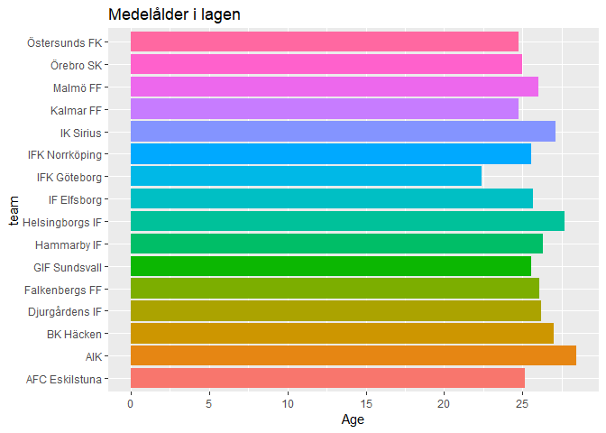

HW6
================
Philip Sierpinski
14 december 2018

``` r
library(tidyverse)
library(rvest)
library(stringr)
library(purrr)
library(httr)
```

``` r
#read the html
main_page <- read_html("http://www.elitefootball.com/league?leagueId=1")
#extract the hyperlinks for each team
team_links <- main_page %>% 
  html_nodes(".table-condensed a") %>% 
  html_attr("href")
#extract the team name as simple text
team_names <- main_page %>%
  html_nodes(".table-condensed a") %>%
  html_text()
#store results in a df
team_info <- data.frame(team = team_names, link = team_links, stringsAsFactors = FALSE)
team_info
```

    ##               team                      link
    ## 1   AFC Eskilstuna /team/afc-eskilstuna/6185
    ## 2              AIK               /team/aik/1
    ## 3        BK Häcken        /team/bk-häcken/11
    ## 4   Djurgårdens IF    /team/djurgårdens-if/3
    ## 5   Falkenbergs FF   /team/falkenbergs-ff/18
    ## 6    GIF Sundsvall    /team/gif-sundsvall/24
    ## 7      Hammarby IF       /team/hammarby-if/9
    ## 8  Helsingborgs IF  /team/helsingborgs-if/10
    ## 9      IF Elfsborg      /team/if-elfsborg/29
    ## 10    IFK Göteborg      /team/ifk-göteborg/7
    ## 11  IFK Norrköping   /team/ifk-norrköping/22
    ## 12       IK Sirius        /team/ik-sirius/33
    ## 13       Kalmar FF        /team/kalmar-ff/12
    ## 14        Malmö FF         /team/malmö-ff/13
    ## 15       Örebro SK        /team/örebro-sk/15
    ## 16   Östersunds FK   /team/östersunds-fk/344

Error handling is abit iffy, this is because all URL's that start with "<http://www.elitefootball.com>" return a request$status\_code == 200 which returns a FALSE for http\_error(and therefore is a valid URL), regardless if the URL leads to a correct (containing a team) webpage or not.

I.E a URL "<http://www.elitefootball.com/team/halmstads-bk/8>" which is correct, will have the same status\_code as "<http://www.elitefootball.com/pagethatdoesnotexist>" that is not correct.

Using a URL "<http://google.com/fakepagethatdoesnotexist>" does indeed work in the sense that the function returns an error.

A solve for this could be to :

Include a regex to check if the allowed team names and their responding links (as in the previous exercise) are exactly matched in the partial link argument, and if the partial link is not one of the 16 allowed links - return warning with error handling.

But this does not match the homework assignment, which is to check if the link leads to a valid URL, which unfortunately are all links starting with "<http://www.elitefootball.com>".

``` r
scrape_players <- function(partial_link){
  full_link <- str_c("http://www.elitefootball.com",partial_link)
  request <- GET(full_link)
  if(http_error(request)){ #error handling if TRUE
    warning("Request failed, invalid URL, please check your input")
  } else { #else statement runs the main code
    team_name <- function(full_link) { #anon function that extracts team name from chosen team
      read_html(full_link) %>% 
        html_nodes(css = "#page-title span") %>% #css selector that extracts team name
        html_text() #selector chosen with selectorgadget
    }
    read_html(full_link) %>% 
      html_table(fill = TRUE) %>% 
      .[[which(map_lgl(., function(df) names(df)[1] == "P"))]] %>% #search for table with "P" as first col
      select(-Player) %>% #remove the NA col (flags in table)
      mutate(team = team_name(full_link)[1]) %>% #add team names
      mutate_all(as.character) #have to read col's as char for map to work for some reason
  }
}
scrape_players("/team/djurgårdens-if/3") %>% head()
```

    ##    P  #                Player       Born Height Weight   Contract
    ## 1 GK  1      Andreas Isaksson 1981-10-03    196     77 2018-12-31
    ## 2 GK 30           Tommi Vaiho 1988-10-13    188     86 2021-12-31
    ## 3  D 21        Erik Johansson 1988-12-30    192     89 2022-12-31
    ## 4  D  4     Jacob Une-Larsson 1994-04-08    179     79 2021-12-31
    ## 5  D 13         Jonas OlssonC 1983-03-10    195     84 2018-12-31
    ## 6  D 15 Jonathan Augustinsson 1996-03-30    185     74 2021-12-31
    ##             team
    ## 1 Djurgårdens IF
    ## 2 Djurgårdens IF
    ## 3 Djurgårdens IF
    ## 4 Djurgårdens IF
    ## 5 Djurgårdens IF
    ## 6 Djurgårdens IF

``` r
map_df(team_links, scrape_players) %>% #map all teams into single DF
  mutate(Born = as.Date(Born)) %>% # to be able to calculate ages
  group_by(team) %>% 
  summarise(Age = mean(difftime(Sys.Date(),Born))/365.25) %>%
  mutate( Age = as.numeric(Age)) %>% 
  ggplot(aes(team,Age)) +
  geom_bar(aes(fill=team),stat="identity") + 
  coord_flip()+
  ggtitle("Medelålder i lagen")+
  scale_y_continuous(breaks = seq(0, 35, by = 5))+
  theme(legend.position="none")
```


